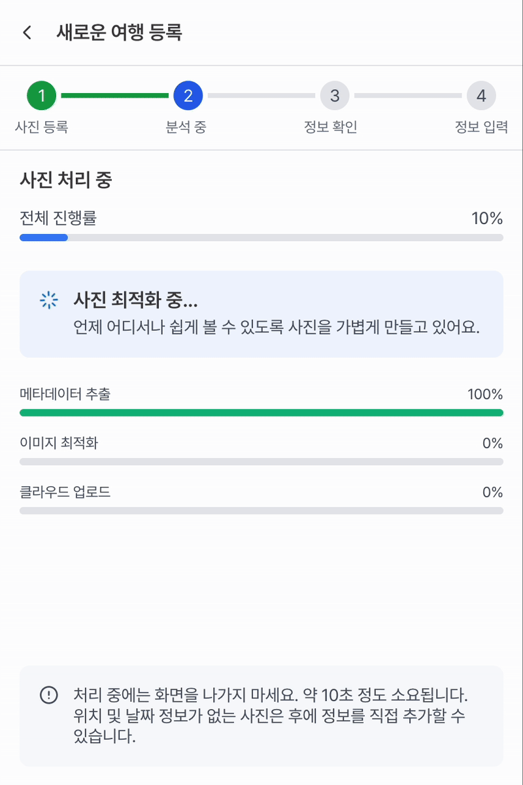
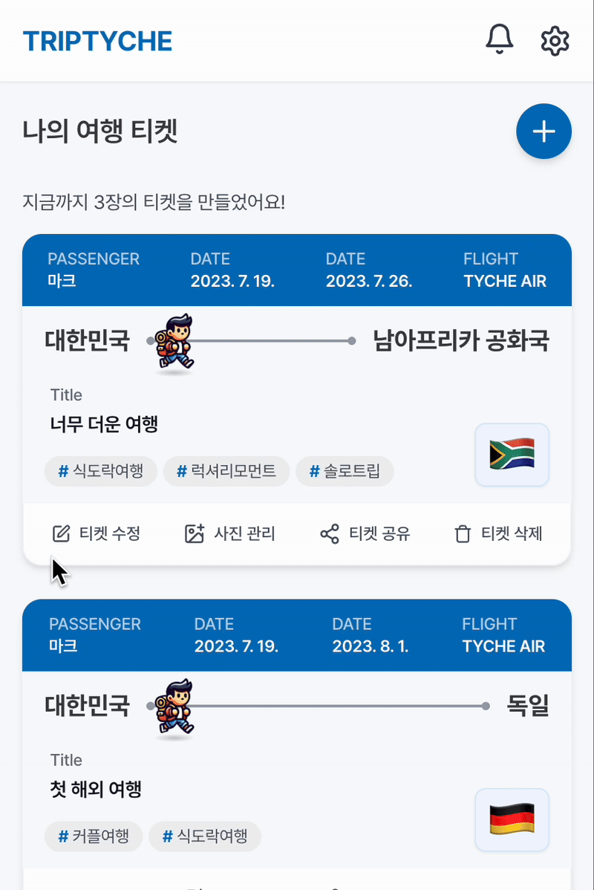
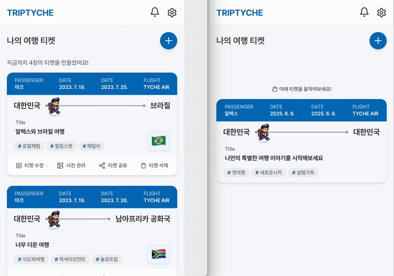
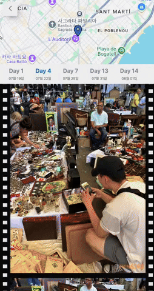

<div align="center">
  
  
  <br/>

🔗 [트립티케 바로가기](https://triptyche.world)

</div>

---

## 📸 About 트립티케 (TripTyche)

트립티케는 **여행 사진 속 메타데이터를 활용해 실제 여행했던 경로를 자동으로 생성**하고, **친구들과 실시간으로 공유**할 수 있는 여행 기록 서비스입니다.

단순히 여행 사진을 저장하는 것이 아닌 **캐릭터가 실제 경로를 따라 움직이며 실제 여행을 재현**하고, **보딩패스 스타일의 여행 티켓**으로 추억을 저장할 수 있습니다.

Safari/iOS의 HEIC부터 JPG까지 **모든 이미지 형식을 지원**합니다.

---

## 목차

### ✨ 핵심 기능

- [🎫 원클릭 여행 티켓 생성](#1-🎫-원클릭-여행-티켓-생성)
- [👥 실시간 여행 공유 & 공동 편집](#2-👥-실시간-여행-공유--공동-편집)
- [🎬 인터랙티브 여행 경로 재현](#3-🎬-인터랙티브-여행-경로-재현)
- [📅 위치·날짜별 사진 관리 & 보기](#4-📅-위치날짜별-사진-관리--보기)

### 🛠️ 프로젝트 기술 스택

- [기술 스택](#🛠️-기술-스택)

### 📂 프로젝트 구조

- [도메인 중심 아키텍처로의 리팩토링](#1-도메인-중심-아키텍처로의-리팩토링)
- [데이터 흐름 및 에러 처리 설계](#2-데이터-흐름-및-에러-처리-설계)

### 💡 핵심 기술적 구현

- [🖼️ 다형식 이미지 처리 파이프라인](#🖼️-다형식-이미지-처리-파이프라인)
- [📱 모바일 환경 최적화](#📱-모바일-환경-최적화)
- [⚡ WebSocket 기반 실시간 협업](#⚡-websocket-기반-실시간-협업)
- [🗺️ Intersection Observer 지도 연동](#🗺️-intersection-observer-지도-연동)

---

## ✨ 핵심 기능

### 1. 🎫 원클릭 여행 티켓 생성

Safari HEIC 형식까지 자동 감지하여 JPG 변환 처리하고, 3단계 이미지 최적화를 거쳐 여행 티켓을 생성합니다.

|                                          |                       |
| :---------------------------------------------------------------------------------------: | :--------------------------------------------------------------------------: |
| **3단계 이미지 처리** <br> 메타데이터 추출→최적화→업로드를<br>실시간 프로그레스 UI로 표시 | **보딩패스 티켓 발급** <br> 여행 정보 입력 후 항공권 디자인의 여행 티켓 생성 |

### 2. 👥 실시간 여행 공유 & 공동 편집

여행 공유, 사진 업로드, 정보 수정 시 실시간으로 알림이 전송됩니다.

|                          |                    |
| :---------------------------------------------------------------: | :---------------------------------------------------------------: |
| **친구에게 여행 공유** <br> 여행 티켓 공유 후 수락/거절 선택 가능 | **실시간 공동 편집** <br> 여러 명이 동시에 사진 추가 및 수정 작업 |

### 3. 🎬 인터랙티브 여행 경로 재현

사진 촬영 시간순으로 실제 여행 경로를 자동 생성하고, 이동 거리에 따라 캐릭터가 동적으로 움직입니다.

|                                       |                                         |
| :------------------------------------------------------------------------------------: | :---------------------------------------------------------------------------------: |
| **거리 기반 애니메이션** <br> 이동 거리에 따른 캐릭터 속도와<br>지도 줌 레벨 자동 조절 | **동적 클러스터링** <br> 줌 확대 시 개별 사진 핀포인트로<br>분리하여 상세 위치 확인 |

### 4. 📅 위치·날짜별 사진 관리 & 보기

메타데이터(위치/날짜) 수정 및 위치와 날짜를 기준으로 사진을 볼 수 있습니다.

|                |                     |       |
| :-------------------------------------------------------------: | :----------------------------------------------------------------: | :-----------------------------------------------------: |
| **메타데이터 편집** <br> 위치/날짜 없는 사진 정보 <br>직접 수정 | **날짜별 듀얼뷰** <br> 상단 지도 + 하단 시간순<br>갤러리 동시 표시 | **위치별 슬라이드** <br> 특정 장소 사진들만 모은 갤러리 |

---

## 🛠️ 기술 스택

### Frontend

React 18, TypeScript, Zustand, Tanstack Query (React Query), Emotion (CSS-in-JS), StompJS (WebSocket)

### Backend

Spring Boot, JPA, MySQL, Redis, JWT, OAuth2, JUnit5

### Infrastructure

Nginx, Docker, AWS EC2, AWS S3, GitHub Actions, Grafana, K6

### External API

Google Maps API (지도, 역지오코딩 및 클러스터링)

---

## 📂 프로젝트 구조

### 1. 도메인 중심 아키텍처로의 리팩토링

기존 `components/`, `hooks/` 등 기술별 구조에서 **비즈니스 도메인 중심**으로 리팩토링했습니다.

**🚫 기존 문제점**

1. 관련 파일 탐색/삭제 시 여러 폴더를 오가야 함
2. 기능 수정 시 흩어진 코드로 인한 유지보수성 저하

**✅ 해결 방안**

각 도메인 내부에서 `components/`, `hooks/`, `types/` 등 관련 코드를 **한 곳에서 독립적으로 관리할 수 있도록 구조를 통합**했습니다.

```
src/
├── domains/                   # 비즈니스 도메인 중심 폴더 구조
│ ├── media/                   # 이미지 관련
│ ├── trip/                    # 여행 생성, 수정, 조회
│ ├── route/                   # 지도 기반 경로 표시
│ ├── share/                   # 여행 공유 및 공동 작업 기능
│ ├── user                     # 사용자 인증 및 설정
│ └── notification/            # 실시간 알림
│
├── shared/                    # 공통 UI, 훅, 스타일, 상수, 타입 등
├── libs/                      # API 클라이언트, WebSocket, 유틸 함수 등
├── layouts/                   # 전체 앱 레이아웃 컴포넌트
├── router/                    # 라우팅 설정
├── pages/                     # 서비스 페이지
└── assets/                    # 이미지, 폰트 등 정적 자원
```

😃 구조 설계부터 리팩토링, 유지보수까지의 전 과정을 **직접 주도하며 반복 개선**하면서, **기능 단위 사고와 설계 역량**을 키울 수 있었습니다.

### 2. 데이터 흐름 및 에러 처리 설계

> **[레이어 기반 프론트엔드 아키텍처 설계](./docs/architecture.md)**

> **[Result 패턴을 활용한 타입 안전한 에러 핸들링](./docs/result-pattern.md)**

---

## 💡 핵심 기술적 구현

### 🖼️ 다형식 이미지 처리 파이프라인

- 바이너리 헤더 분석으로 정확한 형식 판별 (`file.type`이 JPG로 표시되지만 실제론 HEIC인 문제)
- Safari/iOS HEIC 지원 및 3단계 이미지 최적화
- **94% 용량 감소 (4MB→250KB), 90% 업로드 시간 단축**

<!-- > 📖 **[상세한 구현 과정 보기](./docs/image-processing.md)** -->

### 📱 모바일 환경 최적화

- **User-Agent 기반 Android 환경 감지** 및 UX 대응 (Android일 경우, 메타데이터 누락되는 문제)
- **LTE 네트워크 제약** 고려한 이미지 최적화 전략
- 모바일 퍼스트 반응형 디자인

> 📖 **[실제 모바일 환경에서 겪은 문제와 해결 과정](https://velog.io/@now-kwon/모바일-환경-최적화)**

### ⚡ WebSocket 기반 실시간 협업

- STOMP 프로토콜 활용한 안정적 실시간 통신
- 상태 동기화 및 즉시 알림 시스템

<!-- > 📖 **[상세한 구현 과정 보기](./docs/image-processing.md)** -->

### 🗺️ Intersection Observer 지도 연동

- 이미지 스크롤 시 지도 위치 동기화
- 뷰포트 감지로 현재 사진 위치 자동 표시

<!-- > 📖 **[상세한 구현 과정 보기](./docs/image-processing.md)** -->
