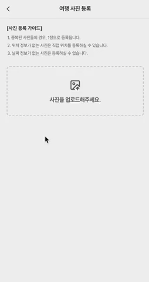
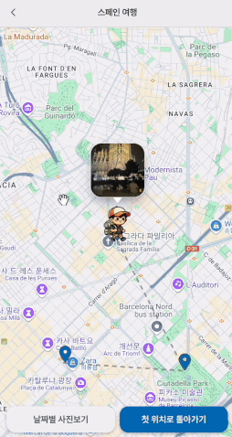
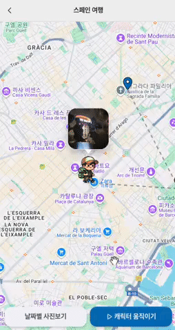

  
  
   

🔗 [트립티케 바로가기](https://triptyche.world)

---

## 📸 About 트립티케

- 트립티케는 여행 사진 속 메타데이터를 활용해 자동으로 여행 경로를 만들어주는 서비스입니다.
- 사진을 업로드하면 위치/날짜 정보가 자동으로 추출되어 구글 맵에 원하는 방식으로 표시됩니다.
- 이미지에 위치 정보가 없다면, 간단히 지도에서 위치를 직접 선택할 수도 있습니다.

### 주요 기능

- 📍 이미지 메타데이터(위치, 날짜) 자동 추출 및 최적화
- 🗺️ Google Maps API 기반 여행 경로 시각화 및 하버사인 알고리즘을 활용한 위치 클러스터링
- 🚶 커스텀 애니메이션과 상태관리를 통한 인터렉티브 캐릭터 애니메이션
- 📱 위치/날짜 기반 여행 사진 갤러리

|                                                기능                                                |                                          기능                                           |
| :------------------------------------------------------------------------------------------------: | :-------------------------------------------------------------------------------------: |
|                                                           |                                                   |
| **자동 위치 정보 추출**   메타데이터(위치, 날짜) 추출 및 리사이징, WebP 변환으로 이미지 최적화 | **인터랙티브 타임라인**   군집화된 여행 경로를 따라 움직이는 캐릭터 애니메이션 제공 |
|                                                 |                                         |
|        **위치별 이미지 슬라이드쇼**   핀포인트에 해당하는 이미지 슬라이드쇼 형식 갤러리        |             **날짜별 듀얼뷰**   시간순으로 정렬된 날짜별 이미지 갤러리              |
|                                                           |                                                                                         |
|    **동적 클러스터링**   Google Maps Clusterer를 활용한 줌 레벨 기반 동적 이미지 클러스터링    |                                                                                         |

---

## 🛠️ 기술 스택

### 프론트엔드

React, TypeScript, Yarn, Zustand, Tanstack-Query, Emotion

### 백엔드

Spring Boot Spring Data JPA, JUnit5, MySQL, JWT, OAuth2

### 인프라

Nginx, Docker, AWS EC2, AWS S3, Github Actions

### 외부 API

Google Maps

---

## 💻 주요 기술적 구현

### 이미지 메타데이터 처리

- EXIF 데이터에서 위치 정보(GPS) 및 시간 정보 추출
- 위치 정보가 없는 이미지는 구글 맵에서 수동 선택 지원
- 이미지 리사이징 및 최적화 처리

### 위치 기반 클러스터링

- 1km 반경 내 사진들을 하나의 포인트로 군집화
- 구글 맵 API를 활용한 마커 클러스터링 구현
- 시간순 정렬로 여행 경로 시각화

### 동적 맵 클러스터링

- Google Maps Clustering API를 활용한 동적 군집화
- 줌 레벨에 따른 자동 클러스터링 조정
- 줌 레벨 17 이상에서 개별 이미지 포인트 표시
- 각 포인트별 포토카드 인터랙션 제공
