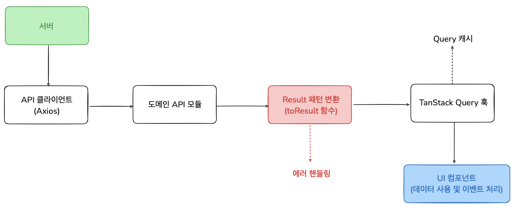

# 레이어 기반 프론트엔드 아키텍처 설계

초기에는 컴포넌트에서 API 호출과 상태 관리를 직접 처리하는 일반적인 방식으로 개발했습니다. 하지만 프로젝트 규모가 커지면서 다음과 같은 문제들이 발생했습니다.

### 1. 컴포넌트의 과도한 책임

UI 렌더링, API 호출, 에러 처리 등 모든 로직이 한 파일에 집중되어 코드가 복잡해지고 유지보수성이 크게 저하되었습니다. 문제 발생 시 원인을 찾기 어려웠고, 하나의 수정이 연쇄적으로 여러 부분에 영향을 미치는 상황이 자주 발생했습니다.

### 2. 재사용성 부족

컴포넌트가 너무 많은 책임을 지게 되어 다른 곳에서 재사용하기 어려웠습니다. 비슷한 로직이 필요할 때마다 새로 작성하게 되었고, 이미 구현된 로직을 중복으로 작성하는 경우도 빈번했습니다.

### 3. 일관성 없는 에러 처리

컴포넌트마다 서로 다른 에러 처리 방식을 사용하여 동일한 에러 처리 로직이 여러 곳에서 중복되는 경우가 종종 발생했습니다.

```tsx
// 기존 방식 - 컴포넌트에 모든 게 뒤섞여 있음
const TripList = () => {
    const [trips, setTrips] = useState([]);
    const [loading, setLoading] = useState(false);
    const [error, setError] = useState(null);

    useEffect(() => {
        const fetchTrips = async () => {
            setLoading(true);
            try {
                const response = await tripAPI.fetchTripTicketList();
                setTrips(response.data.trips);
            } catch (err) {
                setError('여행 목록을 불러오는데 실패했습니다');
            } finally {
                setLoading(false);
            }
        };
        fetchTrips();
    }, []);

    if (loading) return <div>로딩중...</div>;
    if (error) return <div>{error}</div>;

    return <div>{/* JSX */}</div>;
};
```

---

## 레이어 기반 아키텍처 도입

관심사 분리와 단일 책임 원칙을 적용해서 **5개 레이어**로 구조를 나눴습니다.

초기에는 UseCase 레이어까지 고려해봤으나, 현재 서비스 규모에서는 불필요하다고 판단해 서비스 레이어(API 모듈) 수준에서의 레이어 분리를 타협점으로 선택하여, 현재 상황에 적합한 구조를 설계했습니다.

```
HTTP 클라이언트 → 도메인 API → Result 변환 유틸함수 → TanStack Query 훅 → UI 컴포넌트
```

## 

### 1. HTTP 클라이언트 레이어

기본 HTTP 통신 및 공통 로직 처리 레이어

- 인터셉터를 통한 토큰 관리(Acces-Token 재발급)
- 공통 에러 처리(`401`, `403`, `500`)
- 요청/응답 변환

### 2. 도메인별 API 모듈

비즈니스 도메인별 API 엔드포인트 관리

도메인별로 API를 그룹화하여 관리합니다. (예: `tripAPI`, `mediaAPI`)

```ts
export const tripAPI = {
    // 사용자의 전체 여행 티켓 목록 조회
    fetchTripTicketList: async (): Promise<ApiResponse<{ trips: Trip[] }>> => await apiClient.get(`/v1/trips`),

    // 특정 여행의 티켓 상세 정보 조회
    fetchTripTicketInfo: async (tripKey: string): Promise<ApiResponse<Trip>> =>
        await apiClient.get(`/v1/trips/${tripKey}`),

    // 여행 티켓 삭제
    deleteTripTicket: async (tripKey: string): Promise<ApiResponse<string>> =>
        await apiClient.delete(`/v1/trips/${tripKey}`),
};
```

### 3. Result 패턴 변환 레이어

API 응답을 일관된 Result<T> 타입으로 변환

성공/실패를 명시적으로 처리하여 에러 핸들링의 일관성을 보장합니다.

```ts
export const toResult = async <T>(
    fn: () => Promise<ApiResponse<T>>,
    callback?: {
        onSuccess?: () => void;
        onError?: () => void;
        onFinally?: () => void;
    },
): Promise<Result<T>> => {
    const { onSuccess, onError, onFinally } = callback || {};

    try {
        const { data } = await fn();
        onSuccess?.();
        return { success: true, data };
    } catch (error) {
        if (error instanceof AxiosError) {
            const errorResponse = error?.response?.data;
            onError?.();
            return { success: false, error: errorResponse.message };
        }
        return { success: false, error: MESSAGE.ERROR.UNKNOWN };
    } finally {
        onFinally?.();
    }
};
```

### 4. TanStack Query 훅 레이어 (선택적 적용)

데이터 페칭, 캐싱, 요청 재시도 및 백그라운드 데이터 갱신 등을 담당

UI 컴포넌트에서는 이 훅만 사용합니다.

이 레이어는 모든 API 요청에 적용되지 않습니다. **캐싱이 필요한 조회성 데이터**에만 선택적으로 사용하며, 일회성 요청은 이 레이어를 생략하고 Result 변환 레이어를 직접 사용합니다.

```ts
export const useTripTicketList = () => {
    return useQuery({
        queryKey: ['ticket-list'],
        queryFn: () => toResult(() => tripAPI.fetchTripTicketList()),
        select: (result) => {
            return result.success ? { ...result, data: result.data.trips } : result;
        },
    });
};
```

### 5. UI 컴포넌트 레이어

순수하게 데이터 표시와 사용자 인터랙션을 처리

**비즈니스 로직을 최대한 커스텀훅에서 처리**하되, UI 요소는 직접 받지 않고 **콜백 함수를 통해** 받아 훅이 UI와 독립적으로 동작하도록 설계했습니다.

```ts
const TripList = () => {
    const { data: result, isLoading } = useTripTicketList();
    const showToast = useToastStore((state) => state.showToast);

    // 로딩 중 처리
    if (!result) return <LoadingSpinner />;

    // 에러 처리
    if (!result?.success) {
        showToast(result ? result?.error : MESSAGE.ERROR.UNKNOWN);
        return <ErrorFallback />;
    }

    // 데이터 사용
    const tripList = [...result.data].reverse();
    return <TripList trips={tripList} />;
};
```

---

## 각 레이어의 책임

| 레이어          | 담당 영역                | 관심 내용             | 관심 없는 내용     |
| --------------- | ------------------------ | --------------------- | ------------------ |
| UI 컴포넌트     | React, UI 상태           | 렌더링, 사용자 이벤트 | 비즈니스 로직, API |
| TanStack Query  | 쿼리 관리, 비즈니스 로직 | 데이터 흐름, 캐싱     | HTTP 통신, UI 요소 |
| Result 변환     | 에러 타입, 변환 로직     | 성공/실패 처리        | 도메인 지식        |
| 도메인 API      | REST API, 도메인         | 엔드포인트, 비즈니스  | UI 상태, 캐싱 전략 |
| HTTP 클라이언트 | HTTP 통신, 인증          | 네트워크, 보안        | 비즈니스 로직      |

---

## 결과

### 코드가 예측 가능해짐

각 레이어가 명확한 역할을 가지니까 문제가 생겨도 어디를 봐야 할지 바로 알 수 있게 되었습니다. API 문제면 도메인 API 레이어, UI 문제면 컴포넌트 레이어를 확인하면 되니까 디버깅 시간이 많이 줄었어요.

### 재사용이 쉬워짐

커스텀훅이 UI와 독립적이라서 같은 비즈니스 로직을 다른 화면에서도 그대로 사용할 수 있게 되었습니다. 비슷한 기능을 또 만들 필요가 없어졌고요.

### 유지보수가 수월해짐

API 스펙이 바뀌어도 도메인 API 레이어만 수정하면 되고, 새로운 기능을 추가할 때도 **정해진 패턴을 따라서 개발 속도가 빨라졌습니다.**

<br>

결과적으로 단순히 기능만 구현하는 것이 아니라, **확장 가능하고 관리하기 쉬운 구조**를 만드는 것이 얼마나 중요한지 경험할 수 있었습니다.
